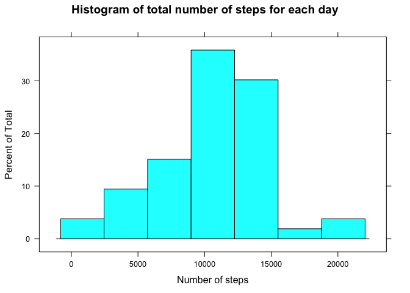
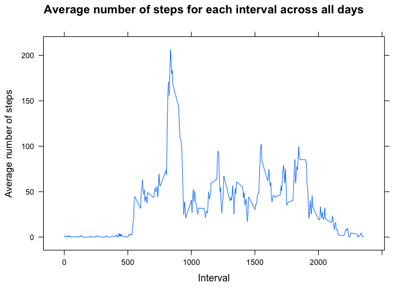
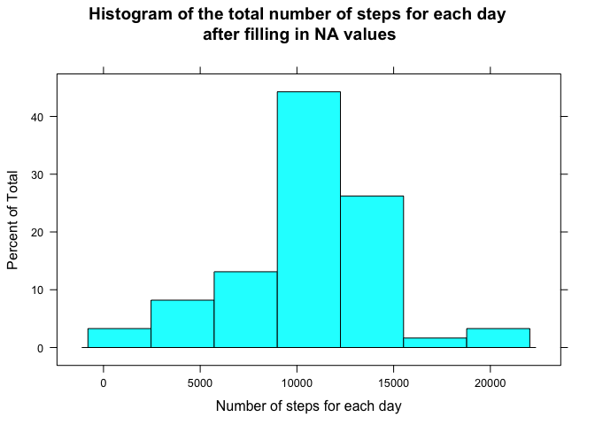
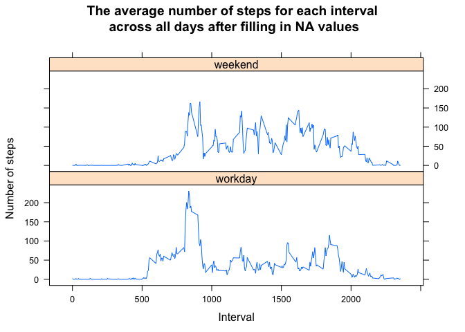

# Reproducible Research: Peer Assessment 1
Ilmira Shaim  

## Version info
R version 3.1.2 (2014-10-31)  
Platform: x86_64-apple-darwin10.8.0 (64-bit)  
attached packages:   
  lattice_0.20-29  
  data.table_1.9.2  

## Loading and preprocessing the data
Reading data from file to data table. We should convert "date" column from character to Date, because "fread" function can't still do it.

```r
library("lattice")
library("data.table")
unzip("activity.zip", overwrite=T)
raw <- fread("activity.csv")

raw <- raw[, date:=as.Date(date)]
dataWithoutNA = raw[complete.cases(raw)]
```

## What is mean total number of steps taken per day?
A histogram of the total number of steps taken each day

```r
sumByDateBeforeFilling <- dataWithoutNA[, sum(steps), by=date]
histogram(sumByDateBeforeFilling$V1,
     main="Histogram of total number of steps for each day",
     xlab="Number of steps")
```

 
  
Calculating the **mean** and the **median** of total number of steps taken per day:

```r
meanSteps = mean(sumByDateBeforeFilling$V1)
medianSteps = median(sumByDateBeforeFilling$V1)
```
  
The mean of the steps is 10766.19.  
The median is equal to 10765.  
  
## What is the average daily activity pattern?
Time series plot  of the 5-minute interval (x-axis) and the average number of steps taken, averaged across all days (y-axis)

```r
meanByInterval = dataWithoutNA[, mean(steps), by=interval]
xyplot(V1~interval,
    data=meanByInterval,
    type='l',
    main="Average number of steps for each interval across all days",
    xlab="Interval",
    ylab="Average number of steps")
```

 
  
Finding 5-minute interval, on average across all the days in the dataset, which contains the maximum number of steps:

```r
maxStepsInterval = meanByInterval$interval[which.max(meanByInterval$V1)]
```
The interval with maximum steps number is 835.  
  
## Imputing missing values
Calculating the total number of missing values in the dataset:

```r
uncompleteCasesTotal = sum(!complete.cases(raw))
```
There are 2304 missing values.  
   
###Strategy of imputing
To fill in all of the missing values in the dataset we will do the following: 
 for the row with a missing value we use mean of steps for its interval.
   
Creating a new dataset that is equal to the original dataset but with the missing data filled in.

```r
raw <- raw[, meanSteps := as.integer(mean(steps, na.rm=T)), by=interval]
fill <- function(x, y) {
  if(is.na(x)) {
    y
  } else {
    x
  }
}
dataWithFilledNAs <- data.table(steps=mapply(fill, raw$steps, raw$meanSteps),
                                date=raw$date,
                                interval=raw$interval)
```
  
Making a histogram of the total number of steps taken each day and calculating the **mean** and **median** total number of steps taken per day. These values differ from the estimates from the first part of the assignment. 


```r
sumByDateAfterFilling <- dataWithFilledNAs[, sum(steps), by=date]
histogram(sumByDateAfterFilling$V1,
     main="Histogram of the total number of steps for each day\n after filling in NA values",
     xlab="Number of steps for each day")
```

 

```r
meanAfterFilling = mean(sumByDateAfterFilling$V1)
medianAfterFilling = median(sumByDateAfterFilling$V1)
```
  
The new mean is 10749.77 which is slightly smaller comparing to the old mean 10766.19.  
The new median is 10641. The old median was also greater: 10765.
  
## Are there differences in activity patterns between weekdays and weekends?

```r
l <- Sys.setlocale("LC_ALL", 'en_US.UTF-8')

weekdayToFactor <- function(x){
  if(x %in% c("Sunday", "Saturday")){
    as.factor("weekend")
  } else {
    as.factor("workday")
  }
}
dataWithFilledNAs <- dataWithFilledNAs[, dayType:=sapply(weekdays(date), weekdayToFactor)]

meanByIntervalAfterFilling = dataWithFilledNAs[, mean(steps), by=list(interval,dayType)]

xyplot(V1~interval|dayType,
     data=meanByIntervalAfterFilling,
     main="The average number of steps for each interval\n across all days after filling in NA values",
     xlab="Interval",
     ylab="Number of steps",
     layout=c(1,2),
     type="l")
```

 

We can see, that in the morning of workdays the number of steps is very high. But on average the number of steps during workday is less than at weekend.
